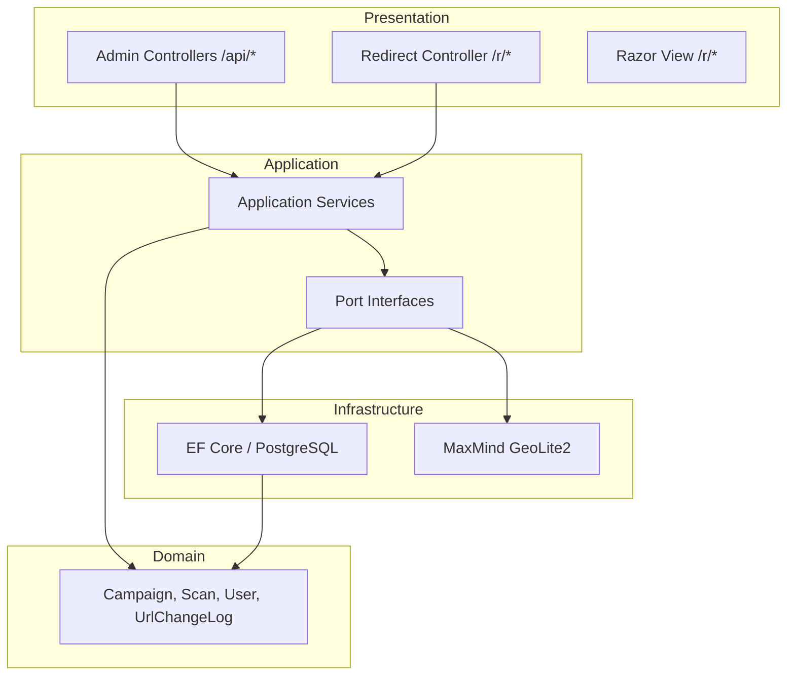

# Dependency Direction

```mermaid
graph TD
    subgraph "Presentation"
        AdminAPI[Admin Controllers /api/*]
        RedirectAPI[Redirect Controller /r/*]
        Interstitial[Razor View /r/*]
    end
    subgraph "Application"
        Services[Application Services]
        Ports[Port Interfaces]
    end
    subgraph "Domain"
        Entities[Campaign, Scan, User, UrlChangeLog]
    end
    subgraph "Infrastructure"
        EF[EF Core / PostgreSQL]
        GeoIP[MaxMind GeoLite2]
    end

    AdminAPI --> Services
    RedirectAPI --> Services
    Services --> Ports
    Ports --> EF
    Ports --> GeoIP
    Services --> Entities
    EF --> Entities
```
