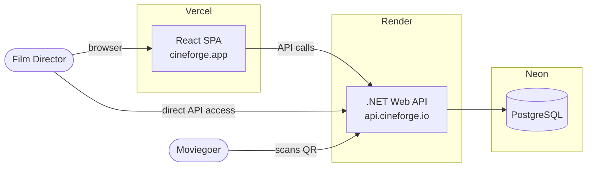
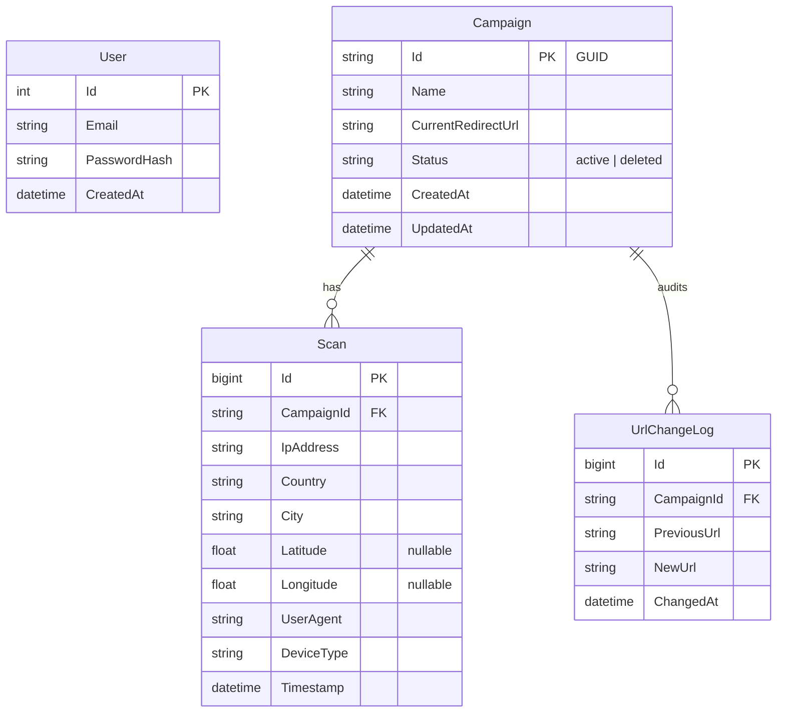

# Structural Seed

## System Context



## Deployment Topology

```
Vercel                          Render                          Neon
┌──────────────┐               ┌──────────────────────┐        ┌──────────┐
│ React SPA     │──────────────│ .NET 10 Web API       │────────│PostgreSQL│
│ (dashboard)   │  API calls   │                      │        │ (Neon)   │
│ cineforge.app │               │ • Admin Controllers  │        └──────────┘
└──────────────┘               │ • Redirect Controller│
                               │ • Razor Interstitial │
                               │ • ASP.NET Identity   │
                               │ • EF Core            │
                               │ • MaxMind GeoLite2   │
                               │ • QRCoder            │
                               └──────────────────────┘
```

## Source Tree

```
CineForge/
├── src/
│   ├── CineForge.Web/              # Presentation — ASP.NET project
│   │   ├── Controllers/
│   │   │   ├── AuthController.cs
│   │   │   ├── CampaignsController.cs
│   │   │   ├── AnalyticsController.cs
│   │   │   └── RedirectController.cs
│   │   ├── Views/                   # Razor views (interstitial page)
│   │   │   └── Redirect/
│   │   │       └── Interstitial.cshtml
│   │   ├── Middleware/
│   │   │   └── RateLimiting.cs
│   │   ├── Program.cs
│   │   └── appsettings.json
│   ├── CineForge.Application/       # Application layer
│   │   ├── Interfaces/              # Port interfaces
│   │   │   ├── ICampaignRepository.cs
│   │   │   ├── IScanRepository.cs
│   │   │   └── IGeoIpService.cs
│   │   ├── Services/
│   │   │   ├── CampaignService.cs
│   │   │   ├── ScanService.cs
│   │   │   └── AnalyticsService.cs
│   │   └── DTOs/
│   ├── CineForge.Domain/            # Domain layer
│   │   ├── Entities/
│   │   │   ├── Campaign.cs
│   │   │   ├── Scan.cs
│   │   │   ├── User.cs
│   │   │   └── UrlChangeLog.cs
│   │   └── Enums/
│   └── CineForge.Infrastructure/    # Infrastructure layer
│       ├── Data/
│       │   ├── AppDbContext.cs
│       │   └── Migrations/
│       ├── Repositories/
│       └── Services/
│           └── GeoIpService.cs
├── frontend/                        # React SPA (Vite)
│   ├── src/
│   │   ├── routes/
│   │   ├── components/
│   │   ├── hooks/
│   │   └── api/
│   ├── package.json
│   └── vite.config.ts
└── CineForge.sln
```

## Core Entity Relationship


